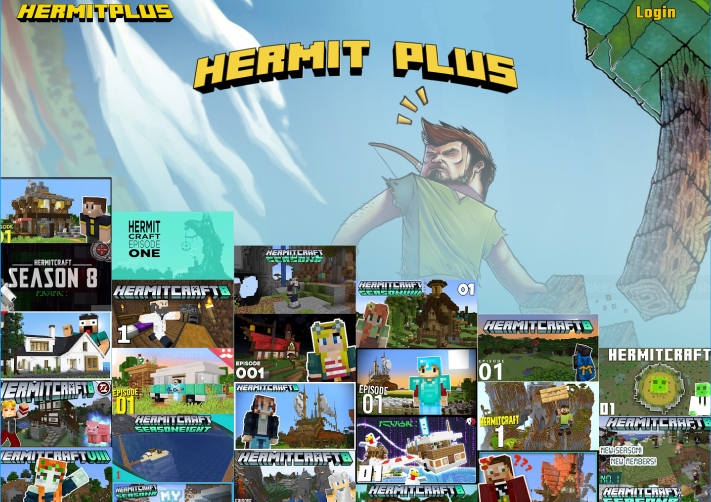

# Hermit-Plus
[Figma file review](https://www.figma.com/file/1rA5nLglFEz6F1453wKwkG/Hermit-Plus?node-id=0%3A1)

[Hermit-Plus preview](https://hermit-plus.vercel.app)

I am a big Minecraft fan and fancy myself a pretty good builder. I love the functionality of the command blocks. They allow one to build any version of the game one would want.

I ran across the hermits many years ago and just love what they have going on. I love the way they interact and the amazing things they build. I am certainly not alone in this seeing as how one of the hermits has over 7 million subscribers.

I have been wanting a way to watch them all together in one place. I would like for them to be a part of the Netflix or Disney + list. Seeing as how that is not the case, I decided to make this app.

### Tech
I am using ReactJs on the frontend with straight css. I do not want to deal with the youtube api just yet, so I am going to use Firebase firestore and storage to house and access the graphics. I used Figma to layout the concept and flow so I have the look and design concept to work from.

### Working
June 26 27, 2021, Over the weekend I focused on the layout and design concept in Figma. I was able to get something I enjoyed and am proceeding forward. If you are interested in the file, [Figma file review](https://www.figma.com/file/1rA5nLglFEz6F1453wKwkG/Hermit-Plus?node-id=0%3A1)

June 28, 2021, Over the past day or so I have been working on the mobile version of the landing page. I finally got it laid out nice and the flow good. Set it up on Vercel and it looks just like I want. Just like the Figma file, with a few very minor exceptions. Here is the link to the Vercel site. Again, as of today, this is mobile only. If viewing on a desktop, inspect it at 425 px or less and refresh the page.
[Hermit-Plus](https://hermit-plus.vercel.app)

July 27, 2001, I don't know when I did it, maybe a few weeks back, but I made some progress on the desktop layout. The desktop has alot more going on and is taking some tweaking. Also, currently it is ver graphics heavy. I will address both or these issues once the layout is done.